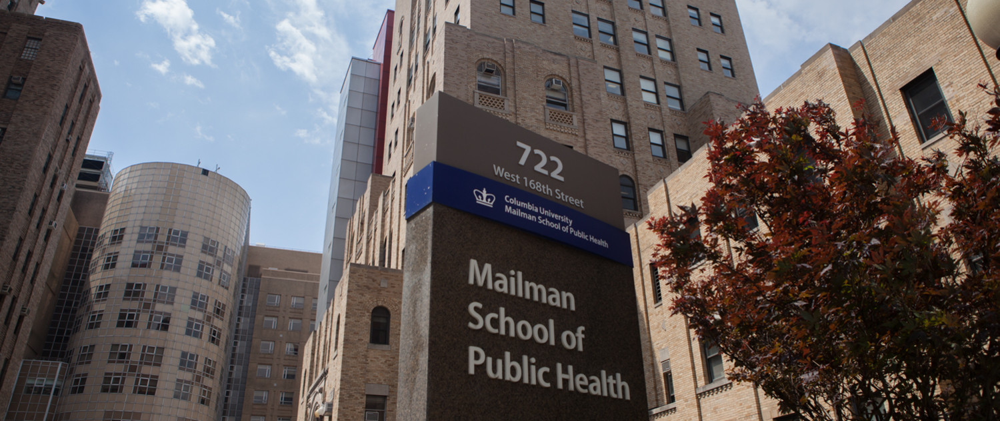

# Welcome! 

## Currently Busy With

The second year of my Master of Public Health degree at Columbia University Mailman School of Public Health.

I also work part-time as a Graduate Research Assistant and Graduate Teaching Assistant (feel free to check out my resume on my "About" page).

## Current Interests

#### Research/Academic

1. Statistical Analysis/Data Science
2. Mental health and applications of behavioral psychology
3. Healthcare policy

#### Personal

1. Breaking a 21-minute 5k
2. Reading at least 3 more books before 2021
3. Getting better at R (and hopefully picking up Python soon)

## Currently Living In

New York City

